# Factors Affecting Food Hygiene - Report

## Background

The Food Hygiene Rating scheme operates in England, Wales and Northern Ireland. Many types of businesses must be inspected and given a score, ranging from restaurants to manufacturers to schools. The scheme was established in 2010, and inspections have occurred regularly since. And establishments are located in both more affluent and more deprived areas. Furthermore, people of various races and ethnicities own establishments, promoting various foreign cuisines we cherish on a regular basis.

Due to these differences, a thorough analysis of factors and their links with food hygiene standards has been performed, with the following factors investigated to discover any insights in food hygiene variations:

- **Country** (England/Wales/Northern Ireland)
- **Business Type** (Restaurants, Takeaways, Schools etc.)
- **Inspection Date** (2010 - present, January - December)
- **Deprivation** (Affluent/Average/Deprived)
- **Race** (White/Black/Asian) [note - this goes by London boroughs with large populations of certain races, since the race of business owners cannot be determined/assumed]

Each factor will now be discussed and key findings will be stated.

## Key Findings

- Businesses in **Northern Ireland** have significantly higher average Food Hygiene Ratings compared to England and Wales.
- **Schools/Universities**, **Farmers** and **Hospitals/Childcare** have the highest average Food Hygiene Ratings.
- **Takeaways** have the lowest average Food Hygiene Ratings by far.
- Businesses have slightly higher average Food Hygiene Ratings when inspected during colder months.

## Detailed Analysis

### Country

The mean Food Hygiene Rating has been calculated for the 3 countries: England, Wales and Northern Ireland. These values are, to two decimal places:

England: 4.63

Wales: 4.58

**Northern Ireland: 4.77**

Clearly, Northern Ireland has by far the highest average Food Hygiene Rating, 0.14 points greater than England and 0.19 points greater than Wales, with the lowest average rating. 

The mean Hygiene scores for the 3 countries are, to two decimal places:

England: 3.05

Wales: 2.94

**Northern Ireland: 2.24**

Again, Northern Ireland performs by far the best in terms of Hygiene, in line with the general Rating trend. The Hygiene standards in Wales are slightly higher than in England, possibly indicating that businesses in Wales take hygienic food handling slightly more seriously than in England, although overall the difference is negligible. Despite all this, Hygiene standards are still very good on average for all 3 countries.

The mean Cleanliness scores for the 3 countries are, to two decimal places:

England: 3.81

Wales: 3.97

Northern Ireland: 3.73

Yet again, Northern Ireland yields the best average cleanliness, but the difference is quite small between all 3 countries. Still, this suggests that on average, businesses in NI are very slightly cleaner than businesses in Wales, with England in the middle. Nonetheless, good standards are universal.

The mean Management scores for the 3 countries are, to two decimal places:

England: 3.99

Wales: 3.89

**Northern Ireland: 3.38**

Unsurprisingly, Northern Ireland has the best average Management of food safety, continuing to support the general trend. England and Wales have similar, slightly lower standards, but still good standards nonetheless.

To support the insights further, rating counts have also been computed and the results are as follows:

England
- 0: 765 (0.18%)
- 1: 5849 (1.38%)
- 2: 6208 (1.47%)
- 3: 25345 (5.99%)
- 4: 60773 (14.37%)
- 5: 323855 (76.6%)

Rating Counts for Wales
- 0: 42 (0.14%)
- 1: 498 (1.66%)
- 2: 407 (1.36%)
- 3: 1991 (6.65%)
- 4: 5159 (17.24%)
- 5: 21835 (72.95%)

Rating Counts for Northern Ireland
- **0: 1 (0.01%)**
- 1: 75 (0.49%)
- 2: 109 (0.71%)
- 3: 528 (3.46%)
- 4: 1857 (12.16%)
- 5: 12704 (83.17%)

These statistics continue to demonstrate the higher Food Hygiene Rating scores in Northern Ireland. A score of 3 or above is considered a pass. Hence, the pass rates are as follows:

England: 96.96%

Wales: 96.84%

**Northern Ireland: 98.79%**

Northern Ireland has by far the highest pass rate, and businesses in England/Wales are over twice as likely to fail than businesses in Northern Ireland.

Furthermore, only 1 zero rating has been recorded in Northern Ireland, compared to 42 in Wales and 765 in England.

One unlikely cause could be that for whatever reason, the inspectors in Northern Ireland are the most lenient, resulting in higher ratings. This however would be very unfair, so this is not a reasonable explanation.

Higher ratings in Northern Ireland are more realisically linked to **mandatory display**. Since 7th October 2016, food safety law enforces that all establishments in Northern Ireland are **legally obliged to display their Food Hygiene Rating sticker in a prominent place**, such as the entrance. This serves as a major motivator for high food hygiene standards, since a low rating would need to be displayed, deterring many potential customers and thus, causing a very negative effect on profit for such businesses. The higher the rating, the more confidence consumers have in the safety of a particular establishment, so this makes mandatory display a reasonable explanation for the higher ratings in NI.

However, there is an **inconsistency** with this explanation, since Wales also has mandatory display, starting even earlier than Northern Ireland, in 2013. This leaves England as the only country without mandatory display (only encouraged display), so one would think that Wales also has higher food hygiene ratings than England. Instead, Wales has a lower average rating than England, contradicting the higher ratings in NI. There must be another underlying reason leading to the lower ratings in Wales, which cannot easily be determined. And equally likely are other reasons for the higher ratings in NI.

### Business Type

It is reasonable to expect Food Hygiene Ratings to vary by business type, because certain establishments need to be much stricter in terms of food safety due to the **type of consumers**, especially when considering consumers that may be immunocompromised or at high risk of food poisoning. Certain business types may also have stricter food safety rules depending on the level of risk to consumers.

The business types considered are as follows:
- Restaurants/Cafes/Canteens
- Takeaways
- Pubs/Bars
- Retailers
- Schools/Universities
- Hospitals/Childcare
- Hotels
- Mobile Caterers
- Manufacturers
- Farmers
- Distributors/Transporters
- Importers/Exporters

And so, here are the average Food Hygiene Ratings for each business type, to two decimal places, from highest to lowest:

1. **Schools/Universities: 4.89**
2. **Farmers: 4.85**
3. **Hospitals/Childcare: 4.83**
4. Mobile Caterers: 4.80
5. Hotels: 4.77
6. Manufacturers: 4.73
7. Distributors/Transporters: 4.73
8. Importers/Exporters: 4.71
9. Pubs/Bars: 4.63
10. Restaurants/Cafes/Canteens: 4.58
11. Retailers: 4.54
12. **Takeaways: 4.28**

The graph is an alternative illustration of the data.
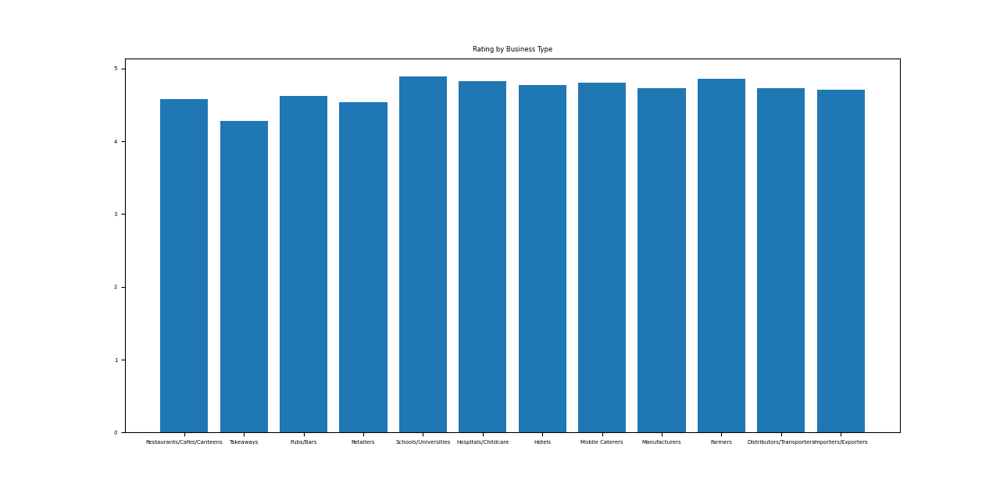

This shows that **Schools/Universities** have the highest average Food Hygiene Rating by quite a lot, 0.04 points greater than the next highest, Farmers. On the other hand, **Takeaways** have the lowest average Food Hygiene Rating by far, a whopping 0.26 points lower on average than the next lowest, Retailers. Nonetheless, there is generally a very good standard of hygiene throughout all business types, except Takeaways of course, where there is a significantly lower standard, but not alarmingly low.

Next, here are the average Hygiene scores by business type, rounded to two decimal places, from best to worst:

1. **Farmers: 1.66**
2. Importers/Exporters: 1.72
3. Schools/Universities: 1.90
4. Distributors/Transporters: 1.93
5. Manufacturers: 2.19
6. Mobile Caterers: 2.34
7. Hospitals/Childcare: 2.44
8. Hotels: 2.70
9. Retailers: 2.92
10. Pubs/Bars: 3.10
11. Restaurants/Cafes/Canteens: 3.54
12. **Takeaways: 4.69**

The graph illustrates this data.
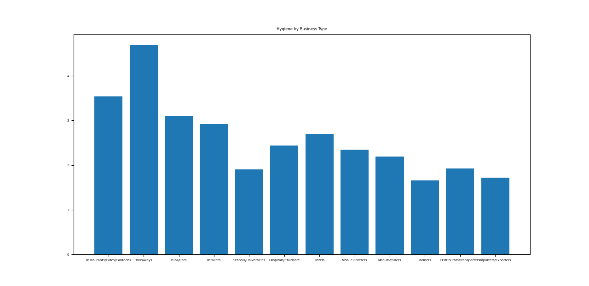

Hygiene standards vary a lot by business type. **Farmers** do the best in terms of Hygiene, followed by various other supplier-based businesses. Other than suppliers, Schools/Universities do well too, ranking third. Again, following the Rating trend, **Takeaways** have significantly worse average Hygiene scores, 1.15 points greater than the next worst, Restaurants/Cafes/Canteens.

Next, here are the average Cleanliness scores by business type, rounded to two decimal places, from best to worst:

1. **Farmers: 2.38**
2. Importers/Exporters: 2.43
3. Mobile Caterers: 2.62
4. Distributors/Transporters: 2.93
5. Hospitals/Childcare: 2.96
6. Schools/Universities: 3.06
7. Hotels: 3.25
8. Manufacturers: 3.33
9. Retailers: 3.93
10. Restaurants/Cafes/Canteens: 4.34
11. Pubs/Bars: 4.52
12. **Takeaways: 5.47**

The graph illustrates this data.
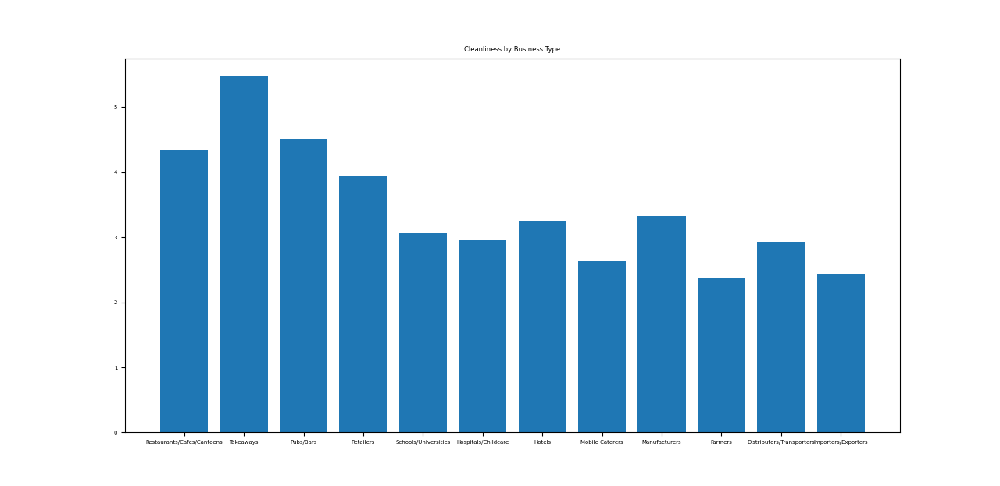

Cleanliness standards certainly vary across different business types. **Farmers** have the best cleanliness scores, followed closely by Importers/Exporters. Mobile Caterers do well in terms of cleanliness too. Unfortunately, **Takeaways** again appear to be the least clean on average by far, 0.95 points greater than the next worst, Pubs/Bars.

Finally, the average Management scores by business type are as follows, to two decimal places:

1. **Schools/Universities: 2.37**
2. Farmers: 2.67
3. Importers/Exporters: 3.11
4. Hospitals/Childcare: 3.22
5. Distributors/Transporters: 3.22
6. Mobile Caterers: 3.35
7. Hotels: 3.52
8. Manufacturers: 3.55
9. Pubs/Bars: 3.83
10. Retailers: 4.19
11. Restaurants/Cafes/Canteens: 4.31
12. **Takeaways: 5.65**

The graph illustrates this data.
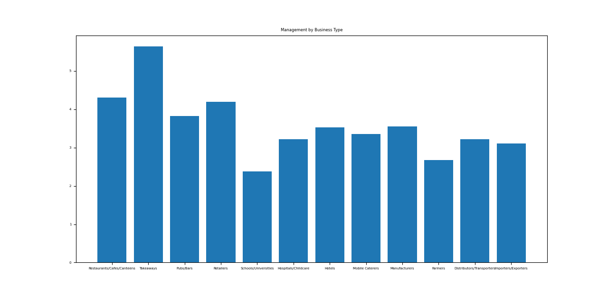

There is a huge disparity in Management standards across different business types. On one hand, **Schools/Universities** have by far the highest Management standard 0.30 points less than the next best, Farmers. Conversely, **Takeaways** score 5.65 points in Management on average, a whopping 1.24 points greater than the second worst, Restaurants/Cafes/Canteens.

Based on these statistics, the business types that stand out most are as follows:

- Schools/Universities
- Hospitals/Childcare
- Farmers
- Takeaways

**School/Universities**, as already seen, have the highest average Food Hygiene Ratings, scoring very well on average in terms of Hygiene, Cleanliness and Management. This is because the **health and safety of children and staff** is taken extremely seriously, particularly since children have **less developed immune systems** and are more prone to allergies. Food contamination may lead to food poisoning or allergic reactions, which may be life-threatening, and will result in **lost education** for students or teaching time for teachers, something which has negative future consequences. Hence, very good Hygiene scores are attained. Cleanliness standards are naturally very high in school kitchens as part of the stringent food safety standards. Since **allergic reaction prevention** is one the most important policies in schools, school canteen staff are extremely well trained in food safety practices ensuring unsafe food is avoided by those with allergies, hence resulting in very good Management scores.

Likewise, **Hospitals/Childcare** also yield very high food safety standards, and this is completely as one would expect. In hospitals, many patients have **weakened immune systems** and/or are **older**, and the nature of hospitals means they are major sources of infection due to sick patients. Safe, nutritious food is a cruical step in the recovery process for patients, whereas contaminated food has a much higher chance of leading to food poisoning in hospitals than usual, due to the high rate of immunocompromisation, and food poisoning also has a much higher chance of causing **life-threatening complications** in sick patients than in healthy individuals. Therefore, Hygiene is vitally important in hospitals. Hospitals are also naturally kept extremely clean, and so are their kitchens, as part of the safe environment. And so, Management of food safety is paramount, as part of patient protection. Childcare settings also follow the same idea, where **young children have underdeveloped immune systems** so need to be protected extra carefully from food poisoning or the complications could be very serious.

Slightly differently, **Farmers** score very well in terms of food hygiene, not because they directly involve high-risk consumers, but probably because there are **less food safety procedures** to follow. As farms, by nature, involve live animals and are generally outdoors, a high level of Hygiene and Cleanliness cannot be achieved like in a typical kitchen, so some degree of leniency is to be expected. Decent Management is expected, but due to the relatively **basic** food safety requirements for Farmers, it is somewhat easier for Farmers to score highly compared to other business types that provide food directly to consumers.

On the other hand, **Takeaways** clearly score most poorly in all aspects of the Food Hygiene Rating scheme, suggesting worse food safety standards on average compared to other establishments. This is likely because most takeaways are **small, often family-run businesses**, where the **budget is tight** and there is only a small number of often less qualified staff. Hence, commercial Hygiene and Cleanliness standards may not be reached or maintainable for many takeaways due to the **limited manpower and funds**. Certain structural repairs or safety installations may be unaffordable, impeding food safety. Likewise, due to the limited staff, Management of food safety can be difficult to maintain and unfortunately, lots of takeaways fail in this aspect. In rare cases, but more often than in other business types, takeaway staff are simply unaware about proper **commercial food safety** measures and manage the takeaway kitchen like at home, where food safety can be ignored slightly more, despite the fact that a commercial kitchen needs to comply with food safety laws for public health and safety. The worst cases are staff that completely neglect food safety, again most common in takeaways. Furthermore, a shocking number of takeaways are simply for **money laundering** purposes, where food safety is virtually ignored. The many combined reasons provide a general idea regarding why takeaways have lower average food safety standards.

### Inspection Date

The Food Hygiene Rating scheme was established in 2010 to aid consumers in discovering the levels of food safety in establishments. Inspections have hence taken place for over 10 years, and continue to occur today. And of course, inspections are not seasonal and occur throughout the entire year. Hence, average scores over time (each year) alongside average scores by month (January to December) have been investigated.

Firstly, the average Food Hygiene Ratings for each year since 2010 have been calculated. These values are as follows, to two decimal places:

- 2010: 4.78
- 2011: 4.73
- 2012: 4.74
- 2013: 4.74
- 2014: 4.78
- 2015: 4.80
- 2016: 4.81
- 2017: 4.83
- 2018: 4.82
- 2019: 4.80
- 2020: 4.81
- 2021: 4.80
- 2022: 4.62
- 2023: 4.49

The data can be visualised with this graph.
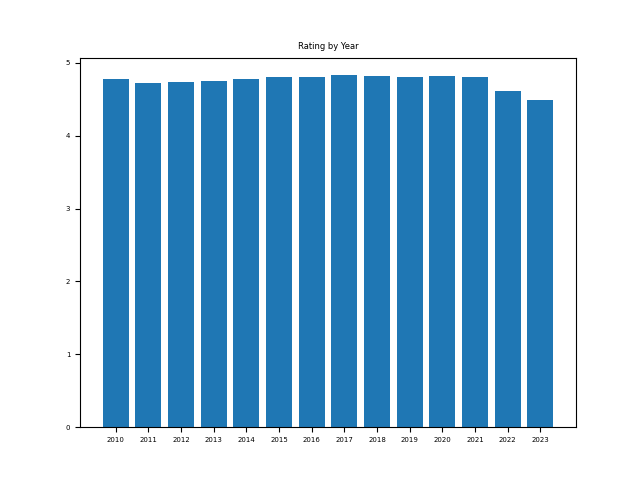

For businesses last inspected before 2022, the average Food Hygiene Rating is very high, going from a very good average of 4.73 in 2011 and peaking in 2017 with an even higher average of 4.83. However, the average rating drops significantly for businesses last inspected in 2022, and for businesses inspected in 2023, the current year as of the analysis, the average rating plummets to 4.49, 0.34 points less than in 2017.

Next, the average Hygiene scores each year are as follows, to two decimal places:

- 2010: 2.96
- 2011: 2.73
- 2012: 2.71
- 2013: 2.48
- 2014: 2.50
- 2015: 2.34
- 2016: 2.23
- 2017: 2.23
- 2018: 2.40
- 2019: 2.39
- 2020: 2.32
- 2021: 2.25
- 2022: 3.07
- 2023: 3.57

The following graph illustrates the data.
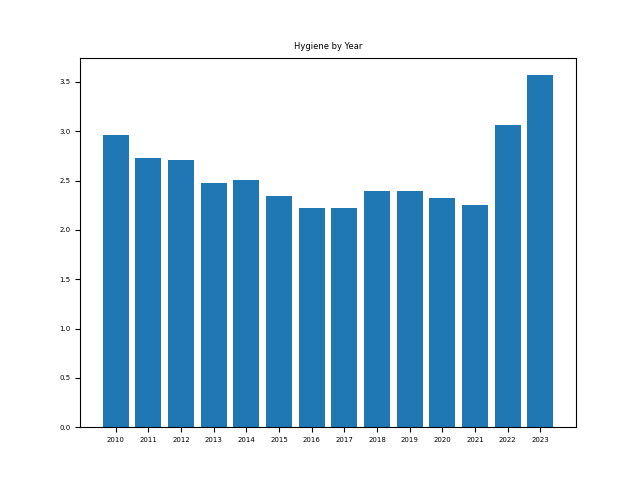

From 2010 to 2021, Hygiene standards have seen a noticeable steady improvement, from an average 2.96 points in 2010 to 2.25 points by 2021, 0.71 points lower. But again, hygiene standards decrease signficantly for businesses inspected in 2022 and furthermore in 2023, with a 3.57 points average in 2023, 1.32 points higher than in 2021.

Next, the average Cleanliness scores each year are as follows, to two decimal places:

- 2010: 2.90
- 2011: 2.99
- 2012: 2.92
- 2013: 3.08
- 2014: 2.94
- 2015: 2.95
- 2016: 2.89
- 2017: 2.93
- 2018: 3.12
- 2019: 3.18
- 2020: 3.01
- 2021: 2.88
- 2022: 3.91
- 2023: 4.45

The following graph illustrates the data.
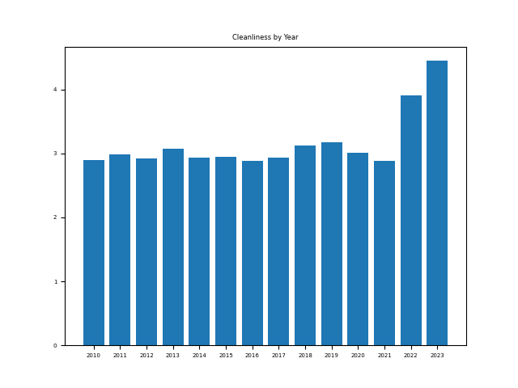

From 2010 to 2021, Cleanliness standards remain somewhat stable, with any differences negligible. However, again, there is a significant decrease in Cleanliness standards in 2022 and standards become even worse in 2023. In 2023, the average Cleanliness score is 4.45 points, a whopping 1.57 points higher than in 2021.

Finally, average Management scores each year are as follows, to two decimal places:

- 2010: 4.00
- 2011: 4.16
- 2012: 4.18
- 2013: 3.88
- 2014: 3.73
- 2015: 3.61
- 2016: 3.30
- 2017: 3.18
- 2018: 3.31
- 2019: 3.33
- 2020: 3.26
- 2021: 3.15
- 2022: 3.97
- 2023: 4.52

The following graph illustrates the data:
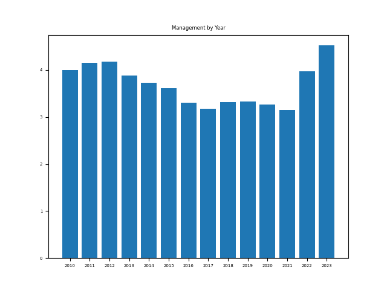

Between 2010 and 2021, Management standards have noticeably improved steadily, levelling off by around 2016. This corresponds to a 0.85 points decrease between 2010 (4.00 points) and 2021 (3.15 points). But unsurprisngly, standards decrese again in 2022, and even more in 2023, with an average of 4.52 points in Management in 2023, 1.37 points higher than in 2021.

Firstly, it is important to know that general food safety standards have probably not simply decreased since 2022 just because of the data. There is a much more realistic explanation for the seemingly decreased standards since 2022.

Food businesses are not inspected at fixed intervals, meaning different types of establishments are inspected at different frequencies. This means higher risk businesses, such as those which specialise in meat, are inspected much more frequently than lower risk businesses where the risk to public health is much lower. The highest risk businesses are inspected every 6 months whereas low risk businesses may go years without being inspected. Restaurants, takeaways and retailers make up most of the businesses and are generally viewed as medium risk, often inspected yearly. Businesses with poor past food safety may also be marked as high risk and inspected more often. Since the data operates on the last inspection of businesses, logically, many of the more recent inspections are for higher risk businesses whereas a few very low risk businesses have not been inspected since 2010. And higher risk businesses usually score more poorly on average due to either more complex/strict food safety requirements or the fact that businesses with a poor food safety record are on average more likely to score worse again. Overall, the most recent inspections consist of many high risk businesses, leaving mostly low risk businesses last inspected before 2022.

The world was faced with the COVID-19 pandemic in 2020/2021. Naturally, once food businesses were able to open again after lockdown, there was extreme emphasis on food safety to protect consumers from the virus. General food safety awareness increased. Hygienic food handling, extreme cleanliness and stringent management were all required as part of reopening during the pandemic, so naturally, food safety standards increased. But this was likely counteracted with increased expectations during inspections given the context. Thus, Hygiene, Cleanliness and Management were all slightly better in 2020, and especially 2021, than in 2019.

Apart from analysis by year, analysis for inspections by the month of the inspection (January to December) has also been conducted to see if scores vary depending on the time of year.

The average Food Hygiene Ratings by month of inspection have been calculated. These values are as follows, to two decimal places, highest to lowest:

1. November: 4.69
2. April: 4.68
3. December: 4.67
4. January: 4.66
5. Februrary: 4.66
6. March: 4.65
7. May: 4.63
8. June: 4.62
9. July: 4.60
10. September: 4.58
11. October: 4.58
12. August: 4.56

The following graph illustrates this data.
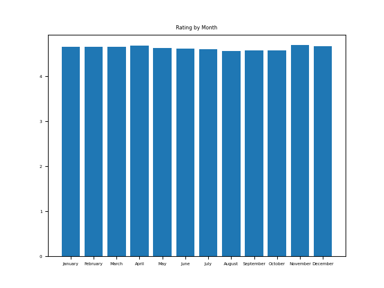

Here, businesses obtain the highest average Food Hygiene Score in November, followed closely by April and the winter months. Conversely, businesses score the lowest in August on average, followed by September, October and the summer months. This suggests that typically, businesses score slightly better during the colder months and worse during the warmer months. The difference between average ratings in November and August is a significant 0.13 points.

Next, the average Hygiene scores by month have been calculated as follows, to two decimal places from best to worst:

1. November: 2.81
2. April: 2.84
3. December: 2.85
4. February: 2.87
5. January: 2.88
6. March: 2.94
7. May: 3.02
8. June: 3.09
9. July: 3.14
10. September: 3.18
11. October: 3.20
12. August: 3.31

The following graph illustrates this data.
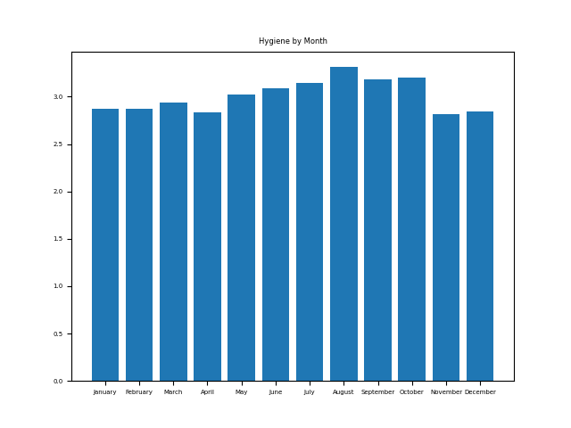

The order is remarkably similar to that of average overall rating, with November yielding the best average Hygiene score and August resulting in the worst average Hygiene score, an overall difference of 0.5 points. Again, this suggests slightly better food hygiene standards during colder months.

In addition, here are the average Cleanliness scores by month, to two decimal places from best to worst:

1. November: 3.61
2. April: 3.62
3. February: 3.69
4. December: 3.70
5. January: 3.72
6. March: 3.74
7. May: 3.80
8. June: 3.88
9. July: 3.92
10. September: 3.97
11. October: 4.01
12. August: 4.08

The following graph illustrates this data:
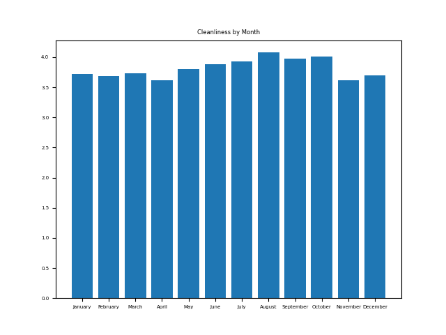

Once again, November and August result in the highest and lowest average Cleanliness scores respectively, an overall difference of 0.47 points. This is in line with the trend seen so far.

Finally, the mean Management scores by month are as follows, to two decimal places:

1. November: 3.70
2. April: 3.77
3. January: 3.80
4. February: 3.81
5. December: 3.82
6. March: 3.90
7. May: 3.95
8. June: 4.00
9. July: 4.06
10. September: 4.14
11. October: 4.19
12. August: 4.27

The following graph illustrates the data.
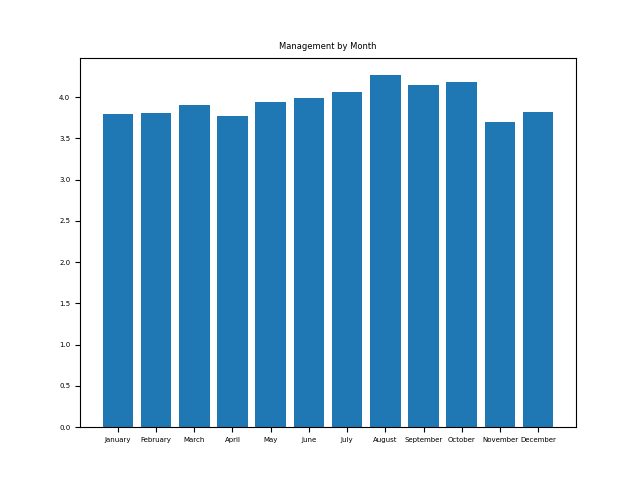

Unsurprisingly, November and August yet again result in the highest and lowest average Management scores respectively, an overall difference of 0.57 points.

Based on all the data, one can deduce that food safety levels are slightly higher during the colder/winter months in all 3 aspects: Hygiene, Cleanliness and Management. Better standards in all aspects will now be interpreted.

During warmer months/summer, food is at higher risk of being too warm causing bacteria to grow and multiply more rapidly. This results in a higher risk of food poisoning which of course is very dangerous. Businesses must take this aspect of food safety extra seriously in summer, due to improper storage of perishable food being partiuclarly dangerous, and so, on average, businesses score lower in terms of Hygiene during warmer months.

Cleanliness variations by season are more difficult to explain, since pests are active all the time but different months involve different pests. A possible reason for lower Cleanliness/Management in summer, especially August, is that staff take time off to go on holiday and take a break. If this is not done correctly, the kitchen cleanliness may decrease during this time provided nobody continues work to maintain cleanliness good standards, and a gap in management checks may also occur at around this time. The slightly higher levels of kitchen neglect during the summer may explain why businesses score slightly worse when inspected during this season, especially in August.